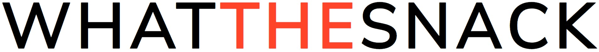
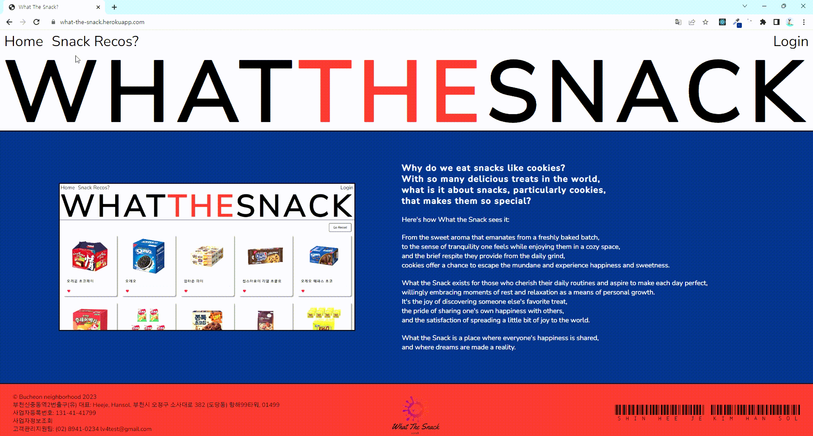

# What The Snack?
[](https://what-the-snack.herokuapp.com/)

<br/><br/>

## 🍿 배포 주소
| 🔸 `배포 링크` : https://what-the-snack.herokuapp.com/ <br/>
| 🔸 `팀 노션` : https://bit.ly/3LMEQUi

<br/><br/>

## 🍿 팀원 소개
| 이름 | 담당 기능 | 블로그 | 깃허브 |
| --- | --- | --- | --- |
| 김한솔 | 게시글 리스트, 글 작성 페이지 | https://oliviakim.tistory.com/108 | https://github.com/hansololiviakim |
| 신희제 | 헤더/메인/푸터, 게시글 상세 페이지 | https://shinheeje.tistory.com/52 | https://github.com/Shinheeje |

<br/><br/>

## 🍿 프로젝트 설명
### 🔸 소개
* What The Snack은 자신이 좋아하는 과자는 소개할 수 있는 웹 페이지입니다.

* 리액트를 사용하여 `기본 CRUD`를 구현하였습니다.

<br/>

### 🔸 기술 스택
| 구분 | 사용 언어 및 패키지 |
| --- | --- |
| Front-End | `React`, `Axios`, `React-query`, `React-router-dom` |
| Back-End | `Json-Server` |
| Environment | `Visual Studio Code`, `Git`, `GitHub` |
| Communication | `Notion`, `Gather Town` |

<br/><br/>

## 🍿 시작 가이드
* [Node.js 18.14.0](https://nodejs.org/ko)

* [yarn 1.22.19](https://classic.yarnpkg.com/lang/en/docs/install/#windows-stable)

<br/>

```bash

$ git clone https://github.com/hansololiviakim/whatTheSnack.git

$ yarn

$ yarn start:dev

```

<br/><br/>

## 🍿 화면 구성
### 🔸 메인 페이지


<br/>

### 🔸 게시글 리스트 페이지


<br/>

### 🔸 게시글 상세 페이지


<br/>

### 🔸 게시글 작성 페이지
